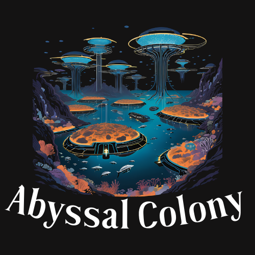
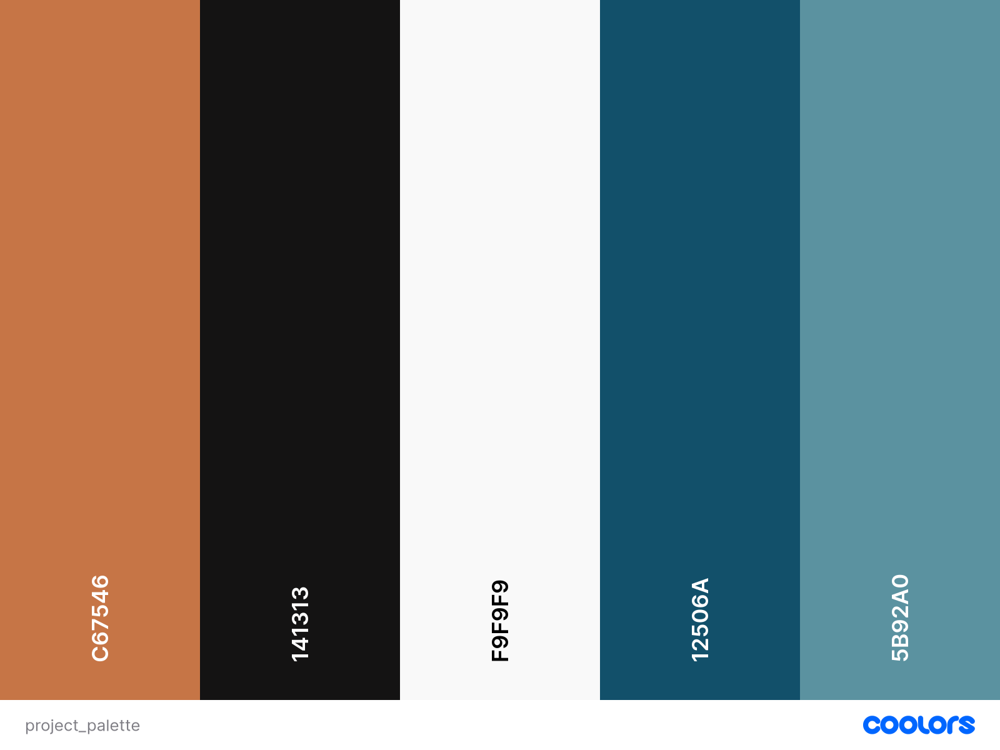
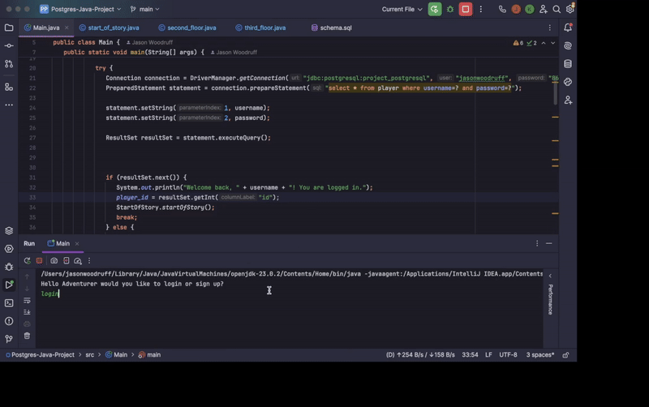

    
  
  # **Abyssal Colony**

  ## **DESCRIPTION**
  You are diver that works for a colony by the deep sea. You're job is to explore the abandoned facility under the colony, don't ask any questions, and survive.

  COLOR PALETTE            |  DEMO
:-------------------------:|:-------------------------:
   |   

## **KEY FEATURES:**
- A sign-up/login form to save progress
- 3 floors to explore
- Each floor has 5+ rooms to explore
- Making important decisions
- Collect Items to aid exploration

## **HOW TO USE (Visual Studio Code)**
1. Type what you would like to do in the prompt
2. Use [search] to scan for items
3. Use [move] to change locations
4. use [inventory] to check what you found
